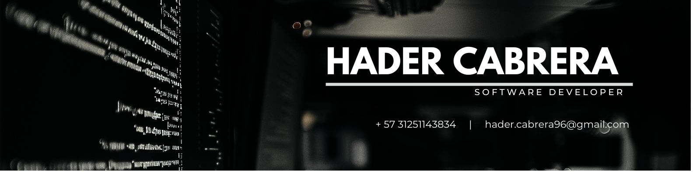

    
    <h1>Hi there 👋, I'm Hader Cabrera.</h1>
    <h3>Soy Ingeniero Mecatrónico con experiencia en diseño e implementación de sistemas mecatrónicos. Actualmente, estoy estudiando desarrollo de software para combinar ambas disciplinas y crear soluciones innovadoras. Tengo conocimientos en Java y Python, y aplico principios de arquitectura SOLID en mis proyectos para asegurar aplicaciones robustas.</h3>

    <a href = "https://www.linkedin.com/in/hadercabrera">
    </img>
    </a>
    <a href = "mailto:hader.cabrera96@gmail.com">
    </img>

---

### About me:

- 🌱 I’m currently learning java and three.js
- 💬 Ask me about python, javaScript, bulma, mySQL.
- 📫 How to reach me: [LinkedIn](https://www.linkedin.com/in/hadercabrera)

 
    <h3>Languages and Tools</h3>
    

        
        
        
        
        
    

---

### My Stacks:

